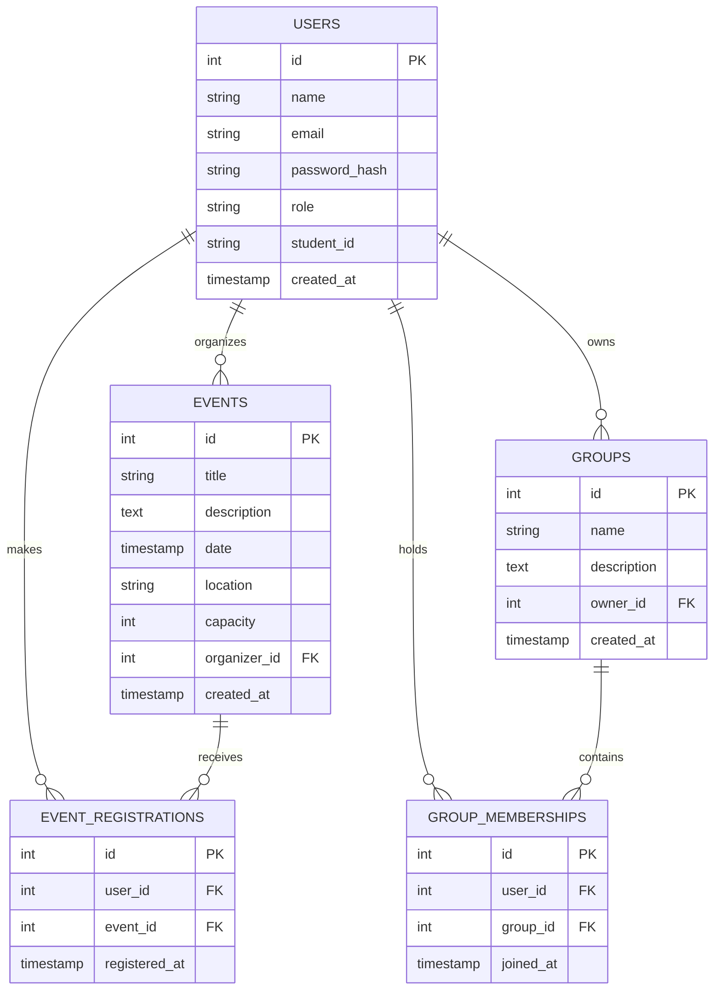

# CampusHub Data Model

## Entity-Relationship Diagram

## Table Definitions

### `users`
Stores all registered users (students and admins).
| Column | Type | Constraints | Description |
|---|---|---|---|
| `id` | SERIAL | PRIMARY KEY | Unique identifier |
| `name` | VARCHAR(255) | NOT NULL | Full name of the user |
| `email` | VARCHAR(255) | UNIQUE, NOT NULL | User's email address |
| `password_hash` | VARCHAR(255) | NOT NULL | Bcrypt hashed password |
| `role` | VARCHAR(50) | NOT NULL DEFAULT 'student' | User role: 'student' or 'admin' |
| `student_id` | VARCHAR(100) | | University student ID (optional for admins) |
| `created_at` | TIMESTAMP | DEFAULT CURRENT_TIMESTAMP | Account creation time |

**Indexes:**
- `idx_users_email` on `email`

### `events`
Stores events created by students.
| Column | Type | Constraints | Description |
|---|---|---|---|
| `id` | SERIAL | PRIMARY KEY | Unique identifier |
| `title` | VARCHAR(255) | NOT NULL | Event title |
| `description` | TEXT | | Event description |
| `date` | TIMESTAMP | NOT NULL | Scheduled date and time |
| `location` | VARCHAR(255) | NOT NULL | Event location (physical or virtual) |
| `capacity` | INT | NOT NULL, CHECK (capacity > 0) | Maximum allowed attendees |
| `organizer_id`| INT | FOREIGN KEY (users.id) | User who created the event |
| `created_at` | TIMESTAMP | DEFAULT CURRENT_TIMESTAMP | Event creation time |

**Indexes:**
- `idx_events_date` on `date`
- `idx_events_organizer` on `organizer_id`

### `event_registrations`
Maps users to the events they are attending.
| Column | Type | Constraints | Description |
|---|---|---|---|
| `id` | SERIAL | PRIMARY KEY | Unique identifier |
| `user_id` | INT | FOREIGN KEY (users.id) ON DELETE CASCADE | Attending user |
| `event_id` | INT | FOREIGN KEY (events.id) ON DELETE CASCADE | Event being attended |
| `registered_at`| TIMESTAMP | DEFAULT CURRENT_TIMESTAMP | Time of registration |

**Constraints:**
- UNIQUE (`user_id`, `event_id`) - A user can only register once per event.

**Indexes:**
- `idx_event_registrations_user` on `user_id`
- `idx_event_registrations_event` on `event_id`

### `groups`
Stores study groups created by students.
| Column | Type | Constraints | Description |
|---|---|---|---|
| `id` | SERIAL | PRIMARY KEY | Unique identifier |
| `name` | VARCHAR(255) | NOT NULL | Group name |
| `description` | TEXT | | Group description |
| `owner_id` | INT | FOREIGN KEY (users.id) | User who created the group |
| `created_at` | TIMESTAMP | DEFAULT CURRENT_TIMESTAMP | Group creation time |

**Indexes:**
- `idx_groups_owner` on `owner_id`

### `group_memberships`
Maps users to the study groups they belong to.
| Column | Type | Constraints | Description |
|---|---|---|---|
| `id` | SERIAL | PRIMARY KEY | Unique identifier |
| `user_id` | INT | FOREIGN KEY (users.id) ON DELETE CASCADE | Group member |
| `group_id` | INT | FOREIGN KEY (groups.id) ON DELETE CASCADE | The study group |
| `joined_at` | TIMESTAMP | DEFAULT CURRENT_TIMESTAMP | Time user joined the group |

**Constraints:**
- UNIQUE (`user_id`, `group_id`) - A user can only be a member of a group once.

**Indexes:**
- `idx_group_memberships_user` on `user_id`
- `idx_group_memberships_group` on `group_id`
